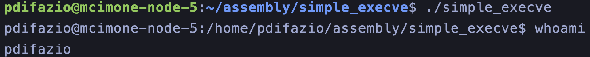

[Black Hat conference ](https://www.youtube.com/watch?v=HCZ6DCu2ciE) and [RISC-V Attacks POC](https://github.com/cispa/Security-RISC/)

**Attack timing differences** in caches and predictors
**Exploit implementation bugs**
**Abusing physical properties** like rowhammer or power analysis

# Side channel attacks
In computer security, a side-channel attack is any attack based on extra information that can be gathered because of the fundamental way a computer protocol or algorithm is implemented, rather than flaws in the design of the protocol or algorithm itself. In this study case, the attacks will work only if the microarchitecture offers **[out of order execution](https://www.cs.uaf.edu/2011/spring/cs641/proj1/vsanditi/)** and **[speculative execution](https://en.wikipedia.org/wiki/Speculative_execution)**.

## Cache Flush and Reload (mitigated)


Usually after a cache miss the data is fetched from the DRAM, but the second time is fetched from the CPU cache that is much faster.


After the attacker flushes the cache, the victim now loads (due to a read operation) a data on the empty cache. 
Now the attacker can read data and due to its access time knows if the data is loaded in cache or not.

## Cache Flush and Fault (new approach)

Again the attacker flushes the cache, then it jump to the address containing victim cache line and handles the error. From the timing of the fault the attacker can predict if the data was on cache or not.


## [Performance Counters](https://docs.openhwgroup.org/projects/cv32e40x-user-manual/en/latest/perf_counters.html)

They give a benchmarking capability. They can count report events like cache missed, instruction executed, CPU frequency etc...
By default performance counters are available also to the attackers on the system. The mitigation for this type of attacks is making the interface root only.


*Some performance counters still remain privileges by standard.* The events are privileged apart from a few. The "branch taken" event is now privileged, but remains the number of **CPU cycles elapsed** and the **number of instruction retired**.

## KASLR: Kernel Address Space Layout Randomization

Randomization of address space at every boot of the system. An attacker to use a memory exploit has to know the addresses of the program before running it.

### BPU: Branch-Prediction Unit

The core idea of this methodolody is that branches impact execution speed. Knowing that there is a jump still doesn't tell what jump is taken in the code.
At this part it comes the **Optimize by Prediction**. The CPU has a history of last branches to optimize the future branches. For example if a code is "always" the processor tends to optimize the jump pre-loading the false branch condition.

## CPU OPTIMIZATION: Speculative Execution

Instead of only predicting the branch, the CPU could actually execute the prediction. That makes modern CPUs very fast. [Spectre](https://spectreattack.com/spectre.pdf) used this optimization to exploit the CPU. *Some RISC-V doesn't have speculative execution*, but they have **speculative prefetching**.
This means that the attacker can let the CPU prefetch whatever he wants.


This also means that **the Speculative Prefetching is exploitable** and Spectre can be exploited on some RISC-V processors. On some specific CPUs it is present the limited speculation that mitigates this attacks.

The speculative execution is often removed from RISC-V processors (for example is missing in the [SiFive](https://www.sifive.com/)) but is present in recent microarchitectures as the [C910/C920](https://github.com/sophgo/sophgo-doc/blob/main/SG2042/T-Head/XuanTie-C910-C920-UserManual.pdf). In the CPU itself, this type of speculation is given by the precondition of the microarchitecture to do [indirect branches](https://en.wikipedia.org/wiki/Indirect_branch), that is the possibility to jump to a register instead of a address jump.

## Case Study: Monte Cimone's RISC-V SiFive u74-mc

On the Monte Cimone's RISC-V cluster it is present the [SiFive U74-MC](https://starfivetech.com/uploads/u74mc_core_complex_manual_21G1.pdf). As the manual says and [as reported from the SiFive statement](https://www.sifive.com/blog/sifive-statement-on-meltdown-and-spectre), the IP core is not allowed to perform speculative execution:

"_Meltdown attacks (CVE-2017-5754) rely upon speculative access to memory that the processor does not have permission to access; our processors do not perform this form of speculation. The Spectre attacks (CVE-2017-5753 and CVE-2017-5715) rely upon speculative memory accesses causing cache state transitions; our processors do not speculatively refill or evict data cache lines._"

Let's try it in the SiFive present on the cluster 


I will run [this](https://github.com/cispa/Security-RISC/tree/main/spectre) spectre POC for RISC-V from Lukas Gerlach, Michael Schwarz and Daniel Weber.


As expected this type of attack is mitigated in this processor due to the **limited speculation**. In general, more optimized cores are more vulnerable. This attack actually works on C910 that allows speculative execution.

## Case Study: Discover Hidden files with retired instructions

In many RISC-V Core implementation there is a counter for the number of instructions retired during the program execution. As the [SiFive U74 manual](https://www.scs.stanford.edu/~zyedidia/docs/sifive/sifive-u74.pdf) says, the `RDINSTRET rd` "Reads the64-bits of the instret CSR, which counts the number of instructions retired by this hart from some arbitrary start point in the past."

In the [PoC](https://github.com/cispa/Security-RISC/blob/main/rlibsc.h) implementation of Cispa's researchers, the `rdinstret` register is printed as follows

```bash
static inline size_t rdinstret() {
  size_t val;
  asm volatile("rdinstret %0" : "=r"(val));
  return val;
}
```

Now we can get the number of instructions retired during the execution of a program. 
An interesting side-channel attack comes out from this. As the researchers present in the [Access Retired PoC](https://github.com/cispa/Security-RISC/tree/main/access-retired), the value of rdinstret can be used to see what the processor has "prefetched". The PoC tries to open various files, which always fails (return value is NULL). However, the number of retired instructions is higher if the file exists. The core concept of this experiment is presented below.

```c
size_t before = rdinstret();
f = fopen(p, "r");
size_t after = rdinstret();
size_t delta = after - before;
```

Here, if the file is present on the filesystem, the number of instructions retired will be higher because **the value of f will not be NULL**. Running the experiment on a folder with no listing permission will give the following result


# Control Flow Integrity: Buffer Overflow & Return Oriented Programming 
In this section It will be analyzed memory attacks such as ROP (Return Oriented Programming) with or without a Buffer Overflow entrypoint.

## ISA Analysis
### Function Calls: Callee and Caller
In programming, the function that calls another function is the `caller` and the called function is the `callee` or `leaf function`. The main itself is a caller function, because It initialzies and call all the following function calls, but is also a callee because It is called at the start of the program by the **start** function. As the image below shows, in the [RISC-V calling convention](https://riscv.org/wp-content/uploads/2015/01/riscv-calling.pdf) there are 12 integer registers (S0-S11) and 12 floating point registers (FS0-FS11) that are preserved across function calls and must be saved by the callee if they are used.
Generally a callee performs a task or computations and returns the result to the caller, _eg: function that performs a sum_.
A function, such as the `main()` function, can be both caller and callee.
In conclusion, callers can use the "S" registers to get the result saved by the callee and callees can use the "T" (temporary) registers to temporary save the data. This is generally true until the program runs out of registers and in this case both the S and T registers can be used, but at the end they have to be backed up.


## 64bit RISC-V Assembly
All the specifications of the RISC-V Assembly are described in the [official manual](https://riscv.org/wp-content/uploads/2017/05/riscv-spec-v2.2.pdf) at Chapter 20.

### Simple Syscall
The following asm code use the system call `exit` loaded with the value `1`. 

```asm
.global _start

.section .text
_start:
	li a0, 1
	li a7, 93
	ecall
```

We can find the syscall number for the riscv64 and many other architectures [here](https://gpages.juszkiewicz.com.pl/syscalls-table/syscalls.html). In this case the exit syscall has the number 93, so It has to be loaded in the register `a7`, **that holds the system call code** and it is called with the parameter 1, loaded in the register `a0`. The `ecall` instruction tells the system to run the system call mapped in the register a7 with the arguments mapped in the argument registers, in this case only a0.

After that, because this is not run through an emulator or in a VM, It will be compiled with the basic GNU assembler.

```bash
riscv64-linux-gnu-as simple_syscall.s -o simple_syscall.o
riscv64-linux-gnu-ld simple_syscall.o -o simple_syscall
```

This will generate an ELF `simple_syscall` program, runnable with

```bash
./simple_syscall
```

We can check the exit status with 

```bash
echo $?
```

And It will tell the last exit status of a program, in this case it will be "1"

### Simple execve: executing /bin/bash

```asm
.global _start

.section .text
_start:
	la a0, shell
	li a1, 0
	li a2, 0
	li a7, 221
	ecall 

	li a0, 1
	li a7, 93
	ecall

shell:
 .ascii "/bin/bash"
```

Here the asm code for calling a simple shell. This will pop a normal shell for the same user that runs the program. The **/bin/bash** string can be replaced to run other type of syscalls. If this program had a setuid bit, the owner was **root** and the bash call preserved the setuid, this program can be a backdoor for the system we are in.



### Simple execve: executing /bin/bash - GCC variant

The following code is generated by GCC that uses libraries. Here we can see that the system call is not an ecall, but is first a jump to the execve function in the C library. In terms of exploitation, this means that there is a "prologue" and an "epilogue" of a function to be respected when calling the execve and the registers we are using in the current call are not preserved across function calls, hence an exploitation is more difficult for this scenario.

```asm
   0x0000000000000668 <+0>:	addi	sp,sp,-16
   0x000000000000066a <+2>:	sd	ra,8(sp)
   0x000000000000066c <+4>:	sd	s0,0(sp)
   0x000000000000066e <+6>:	addi	s0,sp,16
   0x0000000000000670 <+8>:	li	a2,0
   0x0000000000000672 <+10>:	li	a1,0
   0x0000000000000674 <+12>:	auipc	a0,0x0
   0x0000000000000678 <+16>:	addi	a0,a0,36 # 0x698
   0x000000000000067c <+20>:	jal	ra,0x5a0 <execve@plt>
   0x0000000000000680 <+24>:	li	a5,0
   0x0000000000000682 <+26>:	mv	a0,a5
   0x0000000000000684 <+28>:	ld	ra,8(sp)
   0x0000000000000686 <+30>:	ld	s0,0(sp)
   0x0000000000000688 <+32>:	addi	sp,sp,16
   0x000000000000068a <+34>:	ret
```

## ROP Contraints
As It is well explained [here](https://arxiv.org/pdf/2007.14995.pdf), the open source nature of the ISA, brought some security updates to mitigate some ROP attacks. ROPs are built using gadget found across the asm code, that in RISC-V translates in using the epilogue of a function and knowing that the used registers has to be restored. One more complication is the usage of the link register. The purpose of this register is to optimize calls to leaf subroutines since the return address need not be pushed or popped on the stack as It happens in X86_64. As It is specified in the paper, to have a full functional and chainable ROP gadget the following contraints have to be satisfied:

* ROP exploitation is mostly limited to **non-leaf function epilogues**
* Loads a value from a(**sp**) into **ra** where a is some positive immediate value divisible by 8
* Adds an immediate value b to **sp** where b > a and b is divisible by 16 (due to stack-alignment requirements)
* Ends in a **ret** (equivalent to **jr ra**)
* Find some extra instruction to perform operations in the ROP

After that, as suggested in [this](https://pure.royalholloway.ac.uk/ws/portalfiles/portal/37157938/ROP_RISCV.pdf) paper, It could be used a nested function call to emit these save and restore sequences for the registers. As they say, the presence of a **restore sequence** is crucial for mounting a ROP attack, as we need to tamper with the return address register **ra**, which is callee-saved.

### Non-Leaf functions
Consider the following C function

```c
int test_empty() {
    int test = 1;
    printf("test");
    return 1;
}
```

That can be disassembled with

```bash
disasm test_empty()
```

Here there is the disassembled code, using GDB

```gdb
Dump of assembler code for function test_empty:
   0x0000000000000802 <+0>:	addi	sp,sp,-32
   0x0000000000000804 <+2>:	sd	s0,24(sp)
   0x0000000000000806 <+4>:	addi	s0,sp,32
   0x0000000000000808 <+6>:	li	a5,1
   0x000000000000080a <+8>:	sw	a5,-20(s0)
   0x000000000000080e <+12>:	li	a5,1
   0x0000000000000810 <+14>:	mv	a0,a5
   0x0000000000000812 <+16>:	ld	s0,24(sp)
   0x0000000000000814 <+18>:	addi	sp,sp,32
   0x0000000000000816 <+20>:	ret
```

This asm code can't jump to another function and is a "dead end" for the ROP chain. To bypass this wall we must use non-leaf functions. Let's try to add a simple nested function call inside the test_empty().

```c
int test_empty2() {
    int test = 1;
    return 1;

}
int test_empty() {
    test_empty2();
    return 1;
}
```

The disassembled of the test_empty now is the following

```gdb
Dump of assembler code for function test_empty:
   0x0000000000000818 <+0>:	addi	sp,sp,-16
   0x000000000000081a <+2>:	sd	ra,8(sp)
   0x000000000000081c <+4>:	sd	s0,0(sp)
   0x000000000000081e <+6>:	addi	s0,sp,16
   0x0000000000000820 <+8>:	jal	ra,0x802 <test_empty2>
   0x0000000000000824 <+12>:	li	a5,1
   0x0000000000000826 <+14>:	mv	a0,a5
   0x0000000000000828 <+16>:	ld	ra,8(sp)
   0x000000000000082a <+18>:	ld	s0,0(sp)
   0x000000000000082c <+20>:	addi	sp,sp,16
   0x000000000000082e <+22>:	ret
```

Here we se that the ra register is modified with

`0x000000000000081a <+2>:	sd	ra,8(sp)`

and the value is loaded with

`0x0000000000000828 <+16>:	ld	ra,8(sp)`

From this example It is clear that to build gadget a non-leaf function should be used or a leaf function should be modified to embed a **dummy** function call.

`Another consideration is that without the ra register, hence in a leaf function, neither the initial buffer overflow can be done because no ra register is used and no return address can be overwritten.`

### Challenges
> ROP: a function that calls other functions should not assume these registers hold their value across method calls.

> ret2libc: https://github.com/chrysh/riscv_exploitation
