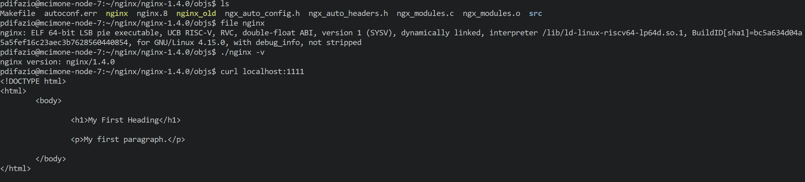

nginx-1.4.0
===========

For the [analysis of CVE-2013-2028](https://www.vnsecurity.net/research/2013/05/21/analysis-of-nginx-cve-2013-2028.html)

## Compiling for RISC-V

There is a custom _install_ directory inside the nginx folder with the configuration required to compile nginx on RISCV.

In the root directory configure the environment in this way

```bash
./configure \
    --prefix=<PATH>/install \
    --sbin-path=<PATH>/install \
    --conf-path=<PATH>/install/nginx.conf \
    --pid-path=<PATH>/install/nginx.pid \
    --error-log-path=<PATH>/install/error.log \
    --without-http_rewrite_module
```

Then do 

```bash
make
```

This will build the program and use the config found in the _install_ folder. If the config is missing it will create it. By default I am choosing the port **1111** in order to run the binary without root permission.

## Compiled binary
The **nginx** binary for RISC-V that I compiled is available [here](https://github.com/BlessedRebuS/RISCV-Attacks/blob/main/nginx-1.4.0/objs/nginx). Make sure to follow the project structure to run the binary.

## Run the binary
To run the binary

```bash
./nginx
```

Testing with

```bash
curl localhost 1111
```

If all is working It should say the following

```html
<!DOCTYPE html>
<html>
<body>
  <h1>My First Heading</h1>
  <p>My first paragraph.</p>
</body>
</html>
```

### Testing in the SiFive cluster environment



## Finding Gadgets

Using ROPGadget we can extract gadget from the binary

```bash
 ROPgadget --rawMode=64 --rawArc=riscv --rawEndian=little --depth=20 --binary=nginx
 ```

This will dump 10MB of gadgets available [here](https://github.com/BlessedRebuS/RISCV-Attacks/blob/main/nginx-1.4.0/gadgets.txt) to be seen.


### Searching for specific gadget

From RiscyROP's paper the ROP generator is capable of finding this gadget

```
; gadget 1
0xb3058: c.ldsp s4,0x28(sp) ; load s4 (for condition
0xb305a: c.ldsp ra,0x8(sp) ; in gadget 4)
0xb305c: c.addi sp,0x10
0xb305e: c.jr ra
```

Using a basic grep altough we can't still find this gadget in a "deep 10" search with ROPGadget.


