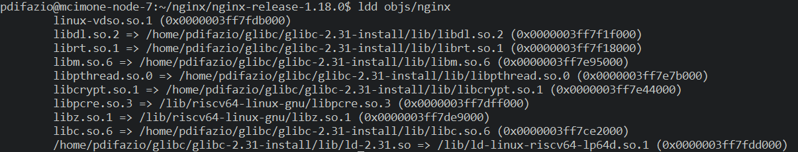

nginx-1.18.0
===========
Testing gadget finding on nginx 1.18 compiled with libc 2.31

## Compiling the libc 2.31

```bash
mkdir $HOME/glibc/ && cd $HOME/glibc
wget http://ftp.gnu.org/gnu/libc/glibc-2.31.tar.gz
tar -xvzf glibc-2.31.tar.gz
mkdir build 
mkdir glibc-2.31-install
cd build
~/glibc/glibc-2.31/configure --disable-werror --prefix=$HOME/glibc/glibc-2.31-install
make
make install
```

## Compiling for RISC-V

There is a custom _install_ directory inside the nginx folder with the configuration required to compile nginx on RISCV. I already configured the Makefile in order to compile nginx on my machine. To compile the binary then use

```bash
make
```

This will build the program and use the config found in the _install_ folder. This binary is compiled only to be disassembled with GDB and print gadgets on my environment. It's not configured to work.

## Compiled binary
The **nginx** binary for RISC-V that I compiled is available [here](https://github.com/BlessedRebuS/RISCV-Attacks/blob/main/nginx-release-1.18.0/objs/nginx).

### Finding out the linkage with the libc version 2.31

I am using `ldd` to find out if the binary has the correct **libc** version as the [RiscyROP](https://www.syssec.wiwi.uni-due.de/fileadmin/fileupload/I-SYSSEC/research/RiscyROP.pdf) paper uses.



## Finding Gadgets

Using ROPGadget we can extract gadget from the binary

```bash
 ROPgadget --rawMode=64 --rawArc=riscv --rawEndian=little --depth=5 --binary=nginx
 ```

This will dump some gadgets available [here](https://github.com/BlessedRebuS/RISCV-Attacks/blob/main/nginx-release-1.18.0/objs/gadgets.txt) to be seen.

### Searching for specific gadget

From RiscyROP's paper the ROP generator is capable of finding this gadget

```
; gadget 1
0xb3058: c.ldsp s4,0x28(sp) ; load s4 (for condition
0xb305a: c.ldsp ra,0x8(sp) ; in gadget 4)
0xb305c: c.addi sp,0x10
0xb305e: c.jr ra
```

Using a basic grep altough we can't still find this gadget in a "deep 5" search with ROPGadget.

This could be because the version of the operating system installed on the cluster: **Ubuntu 22.04.3 LTS**.
